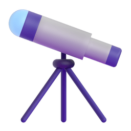
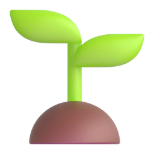

<!-- **FurkanMusa/FurkanMusa** is a ✨ _special_ ✨ repository because its `README.md` (this file) appears on your GitHub profile. -->

<h1 align="left">Slm , ben Furkan  </h1>
<h6 align="right">Nbr</h6>
    

-  All of my projects are available at [**my repositories**](https://github.com/FurkanMusa?tab=repositories)

-  I’m currently working on [my portfolio website.](https://furkanmusa.github.io/weeb/3%20CSS%20-%20Revolution/index.html)

-  I’m currently learning **React.**

-  Ask me about **anything.**

-  [Contact **Me**](mailto:furkan.m.titrek@gmail.com)

<h3 align="left">Languages and Tools:</h3>

 
 

<!-- Buranın böyle olma nedeni github readme.md'leri ne HTML olarak ne de normal markdown olarak renderlıyor, kısıtlamaları var >:l -->
&nbsp;&nbsp;&nbsp;&nbsp;&nbsp;&nbsp;&nbsp;&nbsp;&nbsp;&nbsp;&nbsp;&nbsp;
 

 

 

&nbsp;&nbsp;&nbsp;&nbsp;&nbsp;&nbsp;&nbsp;&nbsp;&nbsp;&nbsp;&nbsp;&nbsp;

 
 
 
&nbsp;&nbsp;&nbsp;&nbsp;&nbsp;&nbsp;&nbsp;&nbsp;&nbsp;&nbsp;&nbsp;&nbsp;
 

<h2> Buralar yeşillenecek yia  </h2> 

